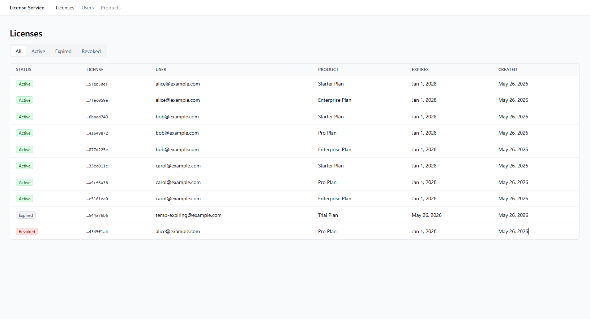
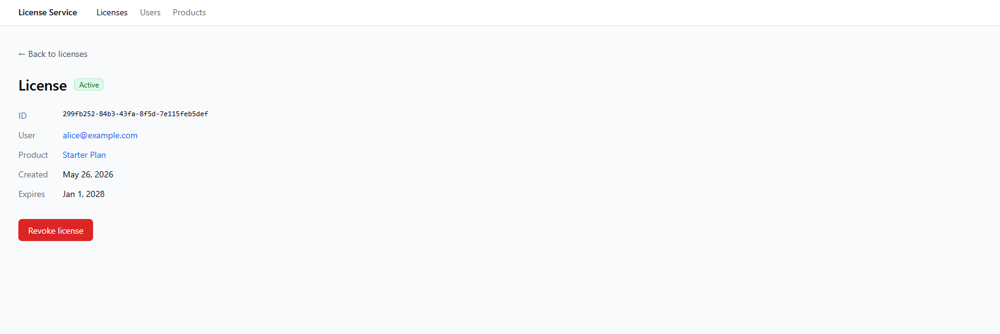
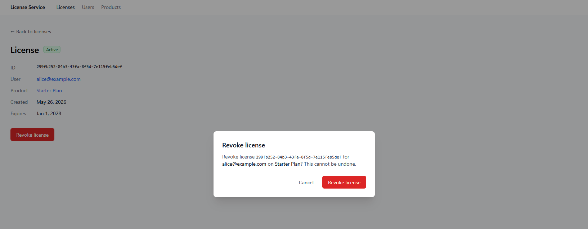
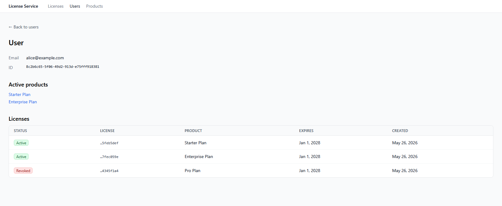

# License Service Dashboard

**Live demo:** https://license-service-dashboard.vercel.app/licenses

A React + TypeScript admin dashboard for the [license-service](https://github.com/lucalamattina/license-service) backend, with list and detail views for licenses, users, and products, status filtering, drill-down navigation, and a confirmation flow for revoking active licenses.

The dashboard is deployed on Vercel and talks to a live `license-service` instance on Heroku. The backend's scheduled BullMQ job expires licenses in real time. See [See all three license states](#see-all-three-license-states) below to watch it happen.

This is a portfolio companion to the substantive [license-service](https://github.com/lucalamattina/license-service) backend; this dashboard exists to make it inspectable without curl or a database client.

## Screenshots









## Stack

React 19 · TypeScript 6 (strict) · Vite 8 · Tailwind CSS 3 · React Router 7 · TanStack Query 5 · Radix Dialog · Sonner · Vitest 4

## See all three license states

The deployed backend's scheduled job expires licenses past their `expires_at`. To see the dashboard render every status (Active → Expired → Revoked), create a license that expires in ~1 minute:

### macOS / Linux / WSL (bash, requires `jq`)

```bash
BASE=https://llamattina-license-service-5c6fae72379f.herokuapp.com
SUFFIX=$(date +%s)
EXPIRES=$(node -e "console.log(new Date(Date.now()+60000).toISOString())")

USER=$(curl -s -X POST $BASE/users -H "Content-Type: application/json" \
  -d "{\"email\":\"trial-$SUFFIX@example.com\"}" | jq -r .id)
PRODUCT=$(curl -s -X POST $BASE/products -H "Content-Type: application/json" \
  -d "{\"name\":\"Trial $SUFFIX\"}" | jq -r .id)
curl -s -X POST $BASE/licenses -H "Content-Type: application/json" \
  -d "{\"user_id\":\"$USER\",\"product_id\":\"$PRODUCT\",\"expires_at\":\"$EXPIRES\"}"
```

### Windows (PowerShell)

```powershell
$BASE = "https://llamattina-license-service-5c6fae72379f.herokuapp.com"
$SUFFIX = [DateTimeOffset]::Now.ToUnixTimeSeconds()
$EXPIRES = (Get-Date).ToUniversalTime().AddSeconds(60).ToString("yyyy-MM-ddTHH:mm:ssZ")

$u = Invoke-RestMethod -Method Post -Uri "$BASE/users" `
  -ContentType 'application/json' -Body "{`"email`":`"trial-$SUFFIX@example.com`"}"
$p = Invoke-RestMethod -Method Post -Uri "$BASE/products" `
  -ContentType 'application/json' -Body "{`"name`":`"Trial $SUFFIX`"}"
$body = @{ user_id = $u.id; product_id = $p.id; expires_at = $EXPIRES } | ConvertTo-Json
Invoke-RestMethod -Method Post -Uri "$BASE/licenses" `
  -ContentType 'application/json' -Body $body | Out-Null
```

Refresh the dashboard. The new license appears in the **Active** filter.

- **Active → Expired:** wait ~2 minutes (one cron tick plus padding) and refresh; the badge flips to **Expired**. The dashboard issued zero writes; only the backend's scheduled job could have done it. The [license-service README](https://github.com/lucalamattina/license-service) walks through why this proves the worker is real.
- **Active → Revoked:** open the license, click **Revoke license**, confirm. The badge flips to **Revoked**.

## Goals

- Provide a clean read-only view of licenses with status, expiration, and ownership.
- Provide drill-down navigation from licenses to users and products.
- Support license revocation with explicit confirmation.
- Communicate state clearly: loading, error, empty, and stale states all handled explicitly.

## Non-goals

- Authentication and authorization (the backend is identity-agnostic; the dashboard mirrors that).
- Creating or editing licenses (revocation is the only mutation; issuance happens via the backend API or MCP server).
- Creating or editing products.
- User creation in the UI (users are assumed seeded via the backend; can be added later).
- Pagination UI (the backend doesn't paginate yet; the dashboard treats lists as small).
- Mobile-responsive layouts beyond basic Tailwind defaults (this is desktop admin tooling).
- Dark mode.
- Real-time updates via websockets or polling (data is refetched on view/refocus only).
- Integration, end-to-end, or comprehensive component test coverage (the data layer has smoke tests, the badge has snapshot tests, and the join logic has pure-function tests; beyond that is production scope).

## Design decisions

**Landing view.** The root route (`/`) redirects to `/licenses`. Licenses are the central artifact of the system and the thing a viewer most often wants to look at; users and products are accessed primarily through drill-down from a license, not as primary entry points. Putting licenses first means the most common task is one click closer than the alternative.

**Server state vs. client state.** All license, user, and product data is server state managed through TanStack Query. The dashboard holds essentially no client-side state beyond router location and transient UI state (open modal, filter selection). This keeps the data flow simple: every view is a function of (URL, server state), and revalidation is the cache's responsibility, not the component's.

**Component structure mirrors REST resource shape.** Each resource (licenses, users, products) has a list view and a detail view, with the list rendering rows that link to detail. This is deliberately conventional rather than clever, so a reader of the code should immediately understand the structure without hunting for it.

**Status visualization.** License status is the primary signal the dashboard surfaces. Active, expired, and revoked statuses are rendered as colored badges with consistent placement: green for active, gray for expired, red for revoked. The same badge component is used wherever status appears so visual scanning is fast.

**Revoke interaction.** The revoke endpoint is the only mutation in v1. The interaction follows a standard admin-tooling pattern: an inline "Revoke" button on the license detail view (disabled for non-active licenses), opening a confirmation modal that summarizes what's about to happen (*"Revoke license [id] for [user_email] on [product_name]? This cannot be undone."*). The destructive action button in the modal is the only path to actually issuing the request. Loading state is shown on the modal's confirm button during the request; on success the modal closes, the license cache is invalidated, and the detail view re-renders with the new status.

This interaction is chosen over the heavier "type the license ID to confirm" pattern because the dashboard is operating on synthetic data, where the friction of typing a UUID would feel performative rather than protective. Production would likely keep the modal pattern but add the typed-confirmation step for licenses associated with paying customers.

**Error handling.** API errors are mapped from the backend's structured error responses (`{ error, message, details }`) into user-facing messages. Validation errors surface inline on form fields where applicable; state-machine violations (e.g., trying to revoke a non-active license) surface as toast notifications. Network failures show a clean error state with a retry affordance, not a blank screen.

**Loading and empty states.** Every list and detail view has explicit loading, empty, and error states. A blank state is never shown because data hasn't loaded yet. There is always either content, a skeleton/spinner, an empty-state message, or an error.

**Routing and URL state.** Filters and selected views are reflected in the URL where it makes sense (e.g., `/licenses?status=active` for a filtered list), so refreshes preserve state and views are shareable. Modal open/close state is not URL-bound; modals are ephemeral.

**Styling approach.** Tailwind utility classes used directly in components. No custom design system. Where compound styling repeats (badges, buttons, modal shells), small typed components encapsulate it. Radix UI (`@radix-ui/react-dialog`) and Sonner are used directly for the modal and toast, with the same accessibility guarantees as shadcn/ui (which wraps these same primitives) and without the CLI setup overhead for a weekend artifact.

## What I'd do differently in production

**Authentication and authorization.** The current dashboard inherits the backend's identity-agnostic design: anyone can do anything. Production would gate admin operations behind an auth flow (OAuth or session-based) and scope visibility to the authenticated user's resources, with explicit admin-role checks for cross-user views.

**Optimistic updates and undo.** The current revoke flow is destructive without undo. Production would either implement soft-revoke with a reversal window (e.g., 30 days before the change becomes permanent) or surface a brief undo affordance in the toast after revocation completes. Optimistic UI updates would make the action feel instant rather than blocking on the API.

**Stronger confirmation for high-stakes revocations.** The current confirmation modal is sufficient for synthetic data but light for real customer licenses. Production would add a typed-confirmation step (user types the license ID or the customer email) for revocations affecting paying customers or licenses above a usage threshold, and would route revocations through an approval queue for the highest-value accounts.

**Pagination and virtualization.** The current list views render every row returned by the backend. Production needs cursor-based pagination on the API side and either pagination UI or virtualization on the dashboard side once data grows past a few hundred rows.

**Bulk operations.** Admin tooling usually grows to need bulk actions (revoke all licenses for a deleted product, expire a batch by date range). Out of scope for v1 but a real production need.

**Audit and history view.** The backend's `state_changed_at` field is internal-only and not exposed in API responses. Production would expose a per-license audit trail so an admin can see when each transition occurred and (with proper auth) who triggered it.

**Form validation matching backend.** v1 has minimal forms (just the revoke confirmation). As more forms get added (license issuance, user creation), production would share Zod schemas between backend and frontend to avoid drift between client and server validation rules.

**Accessibility.** v1 uses semantic HTML and accessible Radix primitives, but doesn't have a formal accessibility audit. Production would test with screen readers, verify keyboard navigation across all views, and ensure WCAG AA color contrast on all status indicators.

**Visual design system.** The v1 dashboard uses Tailwind directly. As the UI grows, this should be refactored into a small component library with consistent spacing, typography, and color tokens. Right now consistency is enforced by convention; production would enforce it by abstraction.

**Real-time updates.** License status can change from the backend (the expiration job runs every minute). The dashboard currently shows stale data until refocus or manual refresh. Production would either poll for changes on visible licenses or use Server-Sent Events to push status changes.

**Tests.** v1 has smoke tests on the data layer (TanStack Query hooks), snapshot tests on the badge component, and pure-function tests on the lookup-map join logic. Production would add component tests for each view, integration tests for the mutation flows, and end-to-end tests for the revoke confirmation path.

## Run locally

Requires the [license-service](https://github.com/lucalamattina/license-service) backend running locally (default `http://localhost:3000`).

```bash
git clone https://github.com/lucalamattina/license-service-dashboard
cd license-service-dashboard
cp .env.example .env
npm install
npm run dev
```

Open `http://localhost:5173`. Adjust `VITE_API_URL` in `.env` if your backend runs elsewhere.

## Scripts

| Command | Purpose |
|---|---|
| `npm run dev` | Vite dev server with HMR |
| `npm run build` | Type-check (strict) + Vite production build to `dist/` |
| `npm run test` | Run Vitest once |
| `npm run test:watch` | Vitest in watch mode |
| `npm run test:ui` | Vitest with the `@vitest/ui` browser inspector |
| `npm run lint` | ESLint |
| `npm run preview` | Serve the production build locally |
